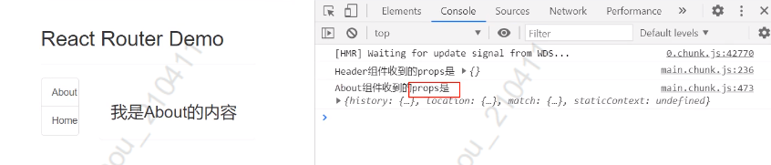
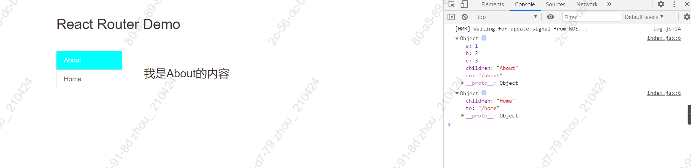

# **一** 对SPA应用的理解

## 1.1 SPA的理解

1. 单页Web应用（single page web application，SPA）。

2. 整个应用只有**一个完整的页面**。

3. 点击页面中的链接**不会刷新**页面，只会做页面的**局部更新。**

4. 数据都需要通过ajax请求获取, 并在前端异步展现。


# 二 React路由

    ## 2.1 路由的理解

1. 一个路由就是一个映射关系(key:value)

2. key为路径, value可能是function或component                 

## 2.2 路由的分类

### 2.2.1 后端路由

1. 理解： value是function, 用来处理客户端提交的请求。

2. 注册路由： router.get(path, function(req, res))

3. 工作过程：当node接收到一个请求时, 根据请求路径找到匹配的路由, 调用路由中的函数来处理请求, 返回响应数据

### 2.2.2 前端路由

1. 浏览器端路由，value是component，用于展示页面内容。

2. 注册路由: 

   ```html
   <Route path="/test" component={Test}>
   ```

3. 工作过程：当浏览器的path变为/test时, 当前路由组件就会变为Test组件。

### 2.2.3 前端路由原理

```html
<body>
    <div>
        <!-- 为何必须要采用return 方法，才能阻止a标签跳转到href页面-->
        <a href="https://www.baidu.com" onclick="return handle('hello world')">push Test</a>
        <!-- return 用来阻止a标签跳转 -->
        <a href="https://www.baidu.com" onclick="return push('/test1')">push Test1</a>
        <button onClick="push('/test2')">push test2</button><br><br>
        <button onClick="replace('/test3')">replace test3</button><br><br>
        <button onClick="back()">&lt;= 回退</button>
        <button onClick="forword()">前进 =&gt;</button>
    </div>
</body>
<script type="text/javascript" src="https://cdn.bootcss.com/history/4.7.2/history.js"></script>
<script>
    // 获取history对象
    // let history = History.createBrowserHistory() //方法一，直接使用H5推出的history身上的API(有可能存在兼容性问题).
    let history = History.createHashHistory(); //方法二，hash值(描点)兼容性极好.
    function push(value) {
        history.push(value);
        return false;
    }
    function replace(value){
        history.replace(value) //会直接替换最顶层的页面，是更新最顶层页面，而不是又压一层进去
    }
    function back(){
        history.goback();
    }
    function forward(){
        history.goForward();
    }
    // path监听
    history.listen((value) => {
        console.log("请求路由路径变化了==>", value);
    });
    // a标签跳转
    function handle(value){
        console.log(value);
        return false;
    };
</script>
```


## 2.3 React路由的基本使用

###  2.3.1 react-router的理解

1. react的一个插件库。

2. 专门用来实现一个SPA应用。

3. 基于react的项目基本都会用到此库。

`react-router`库是`react`专门用来实现路由的，只是这个库下还有三种具体实现方式，分别给三种平台去使用 

1. web平台 -- `react-router-dom`。

2. native移动端开发平台。

3. anywhere兼容web，native通用。

   这里我们只讲`react-router-dom`,也就是`PC`平台使用路由。此处的`dom`特意就是代表`PC`端的`DOM`

   路由器-->`Router`,路由-->`Route`,多个路由`Route`由一个路由器`Router`来管理


### 2.3.2 官方文档

[印记中文](https://docschina.org/)

[react-router](https://react-router.docschina.org/)


### 2.3.3 安装

```shell
yarn add react-router-dom
npm install --save react-router-dom
```


### 2.3.4 Link演示一个基本路由器配置

~~~jsx
import "./App.css";
import { Link, BrowserRouter, Route } from "react-router-dom";
import Home from "./components/Home/index";
import About from "./components/About/index";
function App() {
  return (
    <div className="App">
      <div className="row">
        <div className="col-xs-offset-2 col-xs-8">
          <div className="page-header">
            <h2>React Router Demo</h2>
          </div>
        </div>
      </div>
      {/* 路由器Router一般放在index.jsx里面,这样所有的组件就共用一个Router了 */}
      {/* <BrowserRouter> */}
        <div className="row">
          <div className="col-xs-2 col-xs-offset-2">
            <div className="list-group">
              {/* 原生HTML中,依靠a标签跳转不同的页面 */}
              {/* <a class="list-group-item" href="./about.html">About</a><a class="list-group-item active" href="./home.html">Home</a> */}

              {/* 在React中依靠路由连接切换组件,编写路由链接. Link为一个组件,Router又分为BrowserRouter和HashRoueter,此处嵌套的Router也需要明确指出到
          底使用哪一种前端路由方式 */}
              {/* <BrowserRouter> */}
              <Link className="list-group-item" to="/about">About</Link>
              <Link className="list-group-item" to="/home">Home</Link>
              {/* </BrowserRouter> */}
            </div>
          </div>
          <div className="col-xs-6">
            <div className="panel">
              <div className="panel-body">
                  {/* 注册路由,注意页面上只允许有一个路由器来管理,也就是只能有一个Router,多个Router没有效果*/}
                  {/* <BrowserRouter> */}
                  <Route path="/about" component={ About }/>
                  <Route path="/home" component={ Home }/>
                  {/* </BrowserRouter> */}
              </div>
            </div>
          </div>
        </div>
      {/* </BrowserRouter> */}
    </div>
  );
}
export default App;
~~~


### 2.3.5 小结

```html
1.明确好界面中的导航区、展示区
2.导航区的a标签改为Link标签
  <Link to="/xxxxx">Demo</Link>
3.展示区写Route标签进行路径的匹配
  <Route path='/xxxx' component={Demo}/>
4.<App>的最外侧包裹了一个<BrowserRouter>或者<HashRouter>
```

采用`<HashRouter/>`组件，`URL`地址中将出现一个`#`号，后面的内容都不会发送到服务器，而是默认作为前端资源。


## 2.4 **一般组件和路由组件的区别**

**一般组件和路由组件的区别**

1. 写法不同：一般组件引用。(直接引入，直接使用)

   ~~~jsx
   import Home from '/components/Home.jsx';
   function App(){
       return (
           ......
           <Home/>
           ......
       )
   }
   export default App;
   ~~~

2. 写法不同：路由组件使用。(直接引入，通过路由Link，Route来渲染展示的组件)

   ```jsx
   import Home from '/components/Home.jsx';
   import { Link, Route } from "react-router-dom";
   function App(){
       return (
           ......
           <Link className="list-group-item" to="/home">Home</Link>
           <Route path="/home" component={ Home }/>
           ......
       )
   }
   export default App;
   ```

3. 存放位置不同：路由组件`About`和`Home`组件一般不放在`components`文件夹里面，而是单独放在与`components`平级的`pages`目录里面。

4. 接收到的props不同：路由组件`About`和`Home`与一般组件最大的区别在于

   + 一般组件通过`props`可以接收一些值，如果什么都没有传，则接收`{}`空对象。

   + 路由组件，即使你什么都没有传，它默认也会接收到三个固定的属性。因为可以知道路由组件是由`Route`路由器组件来渲染的，它在渲染对应的路由组件的时候，会向该组件传递一些参数，其中最重要的有三个属性`history`,`location`,`match`。

     ```
     history:
         go: ƒ go(n)
         goBack: ƒ goBack()
         goForward: ƒ goForward()
         push: ƒ push(path, state)
         replace: ƒ replace(path, state)
     location:
         pathname: "/about"
         search: ""
         state: undefined
     match:
         params: {}
         path: "/about"
         url: "/about"
     ```

     


## 2.5 NavLink组件

该组件可以给配置的路由点击的时候设置样式`.active`.该样式为默认样式，可以采用`activeClassName`自定义点击时候的样式

**App.js**

```jsx
import './App.css'
<NavLink to="about" activeClassName="nav_active" className="list-group-item" >About</NavLink>
<NavLink to="home"  activeClassName="nav_active" className="list-group-item" >home</NavLink>
```

**App.css**

~~~css
.nav_active{
    background-color: aqua !important;
    color:white !important;
}
~~~

也可以在`public/index.html`里面单独设置,这样全局共享

~~~html
<style>
    .nav_active{
    background-color: aqua !important;
    color:white !important;
}
</style>
~~~


### 2.5.1封装NavLink组件

封装`NavLink`为`MyNavLink`组件，减少代码，重复利用。

**App.js**

~~~jsx
import MyNavLink from './components/MyNavLink/index.jsx'
function App() {
  return (
    <div>
          ......
          <MyNavLink to="/about" a={1} b={2} c={3}>About</MyNavLink>
          <MyNavLink to="/home">Home</MyNavLink>
          ......
        </div>
    </div>
  );
}
~~~

**MyNavLink.jsx**

~~~javascript
export default class index extends Component {
    render() {
        console.log(this.props);
        return (
            <NavLink activeClassName="nav_active" className="list-group-item" {...this.props}/>
        )
    }
}
~~~

当组件的文本节点为空的时候，其内容节点一般采用`children`中的内容，同时父组件在上送数据的时候，其内容节点也会默认被视作`children`的内容传递给子组件。




