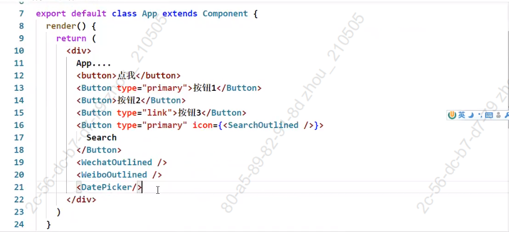
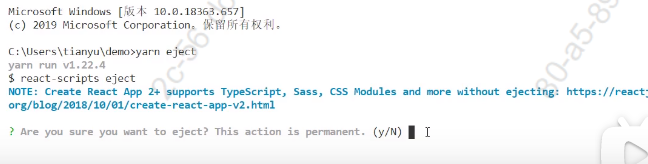
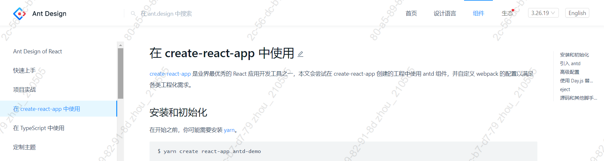
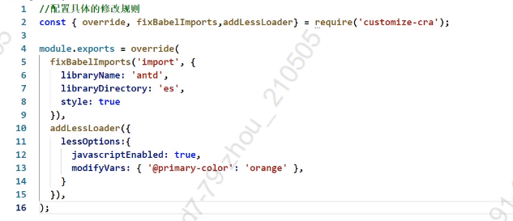

# React UI组件库

## React UI组件库

### material-ui(国外)

1. 官网: [http://www.material-ui.com/#/](#/)

2. github: https://github.com/callemall/material-ui

### ant-design(国内)，antd

1. 官网: https://ant.design/index-cn

2. Github: https://github.com/ant-design/ant-design/

## antd的基本使用

**安装**

~~~shell
yarn add antd / yarn add ant-design
~~~

**引入组件以及样式**

~~~jsx
import {Button} from 'antd';
import 'antd/dist/antd.css';
~~~

**App.jsx**

~~~js
import './App.css';
import { Button,DatePicker} from 'antd';
import { DownloadOutlined,SearchOutlined,WechatOutlined } from '@ant-design/icons';
import 'antd/dist/antd.css'
function onChange(date, dateString) {
  console.log(date, dateString);
}
function App() {
  return (
    

    <button>点击</button>  
    <Button type="primary">Primary Button</Button>  
    <Button type="link">Link Button</Button>  
    <Button type="primary" icon={<DownloadOutlined />} size='large' />  
    <Button type="primary" icon={<SearchOutlined />} size='large' />  
    <WechatOutlined />  
    <DatePicker onChange={onChange} />  
    

  );
}
export default App;
~~~

## antd样式的按需引入

~~~shell
yarn eject //暴露create-react-app所有的配置
~~~

通过该命令可以暴露项目的所有配置，此时可以直接进入配置文件进行修改(但是不推荐这种方式)。

推荐采用**antd官网文档流程实现按需引入**，[antd官网](https://ant.design/docs/react/introduce-cn)

## antd自定义主题

~~~js
1.安装依赖：yarn add react-app-rewired customize-cra babel-plugin-import less less-loader
2.修改package.json
    ....
    "scripts": {
        "start": "react-app-rewired start",
            "build": "react-app-rewired build",
                "test": "react-app-rewired test",
                    "eject": "react-scripts eject"
    },
        ....
3.根目录下创建config-overrides.js
//配置具体的修改规则
const { override, fixBabelImports,addLessLoader} = require('customize-cra');
module.exports = override(
    fixBabelImports('import', {
        libraryName: 'antd',
        libraryDirectory: 'es',
        style: true,
    }),
    addLessLoader({ //自定义主题
        lessOptions:{
            javascriptEnabled: true,
            modifyVars: { '@primary-color': 'green' },
        }
    }),
);
4.备注：不用在组件里亲自引入样式了，即：import 'antd/dist/antd.css'应该删掉
~~~

1. 先卸载less-loader当前版本： `yarn remove less-loader`
2. 再安装7.0.0左右的版本：`yarn add less-loader@7.1.0`
3. 在config-overrides.js配置文件中设置对应的属性

