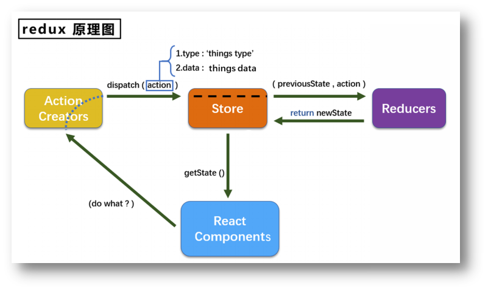

# redux简介

## redux学习文档

1. 英文文档: https://redux.js.org/

2. 中文文档: http://www.redux.org.cn/

3. Github: https://github.com/reactjs/redux

##  redux是什么

1. redux是一个专门用于做**状态管理**的JS库(不是react插件库)。

2. 它可以用在react, angular, vue等项目中, 但基本与react配合使用。

3. 作用: 集中式管理react应用中多个组件**共享**的状态。

## 什么情况下需要使用redux

1. 某个组件的状态，需要让其他组件可以随时拿到（共享）。

2. 一个组件需要改变另一个组件的状态（通信）。

3. 总体原则：能不用就不用, 如果不用比较吃力才考虑使用。

# redux工作流程

# redux的三个核心概念

## action

1. 动作的对象

2. 包含2个属性

   + type：标识属性, 值为字符串, 唯一, 必要属性

   + data：数据属性, 值类型任意, 可选属性

3. 例子：{ type: 'ADD_STUDENT',data:{name: 'tom',age:18} }

## reducer

1. 用于初始化状态、加工状态。

2. 加工时，根据旧的state和action， 产生新的state的**纯函数**

## store

1. 将state、action、reducer联系在一起的对象

2. 如何得到此对象?

+ import {createStore} from 'redux'

+ import reducer from './reducers'

+ const store = createStore(reducer)

3. 此对象的功能?

+ getState(): 得到state

+ dispatch(action): 分发action, 触发reducer调用, 产生新的state

+ subscribe(listener): 注册监听, 当产生了新的state时, 自动调用

# redux-精简版

**原生react求和案例**

**Counter.jsx**

~~~jsx
import React, { Component } from 'react'
import './index.css'
export default class index extends Component {
    state = {
        counter:0
    }
    //正常加法
    normalAdd = ()=>{
        let {value} = this.selectRef;
        let {counter} = this.state;
        this.setState({
            counter:Number(counter)+Number(value)
        })
    }
    //正常减法
    normalSubtract = ()=>{
        let {value} = this.selectRef;
        let {counter} = this.state;
        this.setState({counter:Number(counter)-Number(value)})
    }
    //奇数加
    oddAdd = ()=>{
        let {value} = this.selectRef;
        let {counter} = this.state;
        if(counter % 2 !== 0){
            this.setState({
                counter:Number(counter)+Number(value)
            })
        }
    }
    //异步加
    asyncAdd = ()=>{
    setTimeout(()=>{
        let {value} = this.selectRef;
        let {counter} = this.state;
        this.setState({
            counter:Number(counter)+Number(value)
        })
    },1000)
    }
    render() {
        return (
            

                <h1>当前求和为:{this.state.counter}</h1>
                <select className="select" ref={(e)=>{this.selectRef = e}}>
                    <option value="1" className="option">1</option>
                    <option value="2" className="option">2</option>
                    <option value="3" className="option">3</option>
                </select>&nbsp;&nbsp;
                <button onClick={this.normalAdd}>+</button>&nbsp;&nbsp;
                <button onClick={this.normalSubtract}>-</button>&nbsp;&nbsp;
                <button onClick={this.oddAdd}>求和奇数加</button>&nbsp;&nbsp;
                <button onClick={this.asyncAdd}>异步加</button>&nbsp;&nbsp;
            

        )
    }
}

~~~

**采用精简的redux求和版本**

**安装redux**

~~~shell
yarn add redux
~~~

**创建文件**

~~~shell
src
 |--redux
   |--store.js
   |--counter_reducer.js

~~~

**Counter.jsx**

~~~jsx
import React, { Component } from 'react'
import './index.css'
import store from '../../redux/store.js'
export default class index extends Component {
    state = {carName:'奔驰CS6'}
    componentDidMount(){
    //检测redux中状态的变化，只要变化了，就调用render
    store.subscribe(()=>{
        this.setState({})
    })
    }
    //正常加法
    normalAdd = ()=>{
        let {value} = this.selectRef;
        store.dispatch({type:'normalAdd',data:value})
    }
    //正常减法
    normalSubtract = ()=>{
        let {value} = this.selectRef;
        store.dispatch({type:'normalSubtract',data:value})
    }
    //奇数加
    oddAdd = ()=>{
        let {value} = this.selectRef;
        let counter = store.getState();
        if(counter % 2 !== 0){
            store.dispatch({type:'normalAdd',data:value})
        }
    }
    //异步加
    asyncAdd = ()=>{
    setTimeout(()=>{
        let {value} = this.selectRef;
        store.dispatch({type:'normalAdd',data:value})
    },1000)
    }
    render() {
        return (
            

                <h1>当前求和为:{store.getState()}</h1>
                <select className="select" ref={(e)=>{this.selectRef = e}}>
                    <option value="1" className="option">1</option>
                    <option value="2" className="option">2</option>
                    <option value="3" className="option">3</option>
                </select>&nbsp;&nbsp;
                <button onClick={this.normalAdd}>+</button>&nbsp;&nbsp;
                <button onClick={this.normalSubtract}>-</button>&nbsp;&nbsp;
                <button onClick={this.oddAdd}>求和奇数加</button>&nbsp;&nbsp;
                <button onClick={this.asyncAdd}>异步加</button>&nbsp;&nbsp;
            

        )
    }
}
~~~

**counter_reducer.js**

~~~js
/**
 * 1.该文件是用于创建一个为Counter组件服务的reducer,reducer的本质是一个函数
 * 2.reducer函数会接到两个参数,分别为：之前的状态(preState),动作对象(action)
 */
const initState = 0;
function counterReducer(preState=initState,action){
    //从action对象中获取：type,data;
    const {type,data} = action;
    //根据type决定如何加工数据
    switch (type) {
        case 'normalAdd': //如果是加法
            return preState + data * 1;
        case 'normalSubtract': //如果是减法
            return preState - data * 1;
        default:
            return preState
    }
}
export default counterReducer
~~~

**store.js**

~~~javascript
/**
 * 该文件专门用于暴露一个store对象，整个应用只有一个store对象
 */
//引入createStore,专门用于创建整个redux中最和兴的store对象
import {createStore} from 'redux'
//引入为Counter组件服务的reducer
import counterReducer from './counter_reducer'
//暴露store
export default createStore(counterReducer);
~~~

