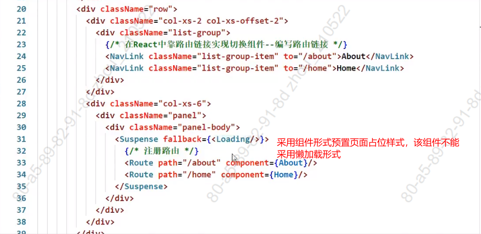

## 1. setState

### setState更新状态的2种写法

```
(1). setState(stateChange, [callback])------对象式的setState
    1.stateChange为状态改变对象(该对象可以体现出状态的更改)
    2.callback是可选的回调函数, 它在状态更新完毕、界面也更新后(render调用后)才被调用

(2). setState(updater, [callback])------函数式的setState
    1.updater为返回stateChange对象的函数。
    2.updater可以接收到state和props。
    3.callback是可选的回调函数, 它在状态更新、界面也更新后(render调用后)才被调用。
总结:
1.对象式的setState是函数式的setState的简写方式(语法糖)
2.使用原则：
    (1).如果新状态不依赖于原状态 ===> 使用对象方式
    (2).如果新状态依赖于原状态 ===> 使用函数方式
    (3).如果需要在setState()执行后获取最新的状态数据, 要在第二个callback函数中读取
```

~~~jsx
import React, { Component } from 'react'
export default class index extends Component {
    state = {count:0}
    add = ()=>{
        //setState方法一:对象式
        // let {count} = this.state;
        //setState更新状态为异步更新，也就是先执行console.log('状态为:',this.state.count);
        //setState方法是同步的，但是调用它所导致的行为却是异步的;
        //this.setState({count:count+1},()=>{console.log('回调函数:',this.state.count);});
        //console.log('状态为:',this.state.count);
        //setState方法二:函数式
        this.setState((state,props)=>{return { count:state.count+1}},()=>{console.log('回调函数:',this.state.count)})
    }
    render() {
        return (
            <div>
                <h1>总共:{this.state.count}</h1>
                <button onClick={this.add}>点击加1</button>
            </div>
        )
    }
}
~~~


## 2. lazyLoad

### 路由组件的lazyLoad

```jsx
//1.通过React的lazy函数配合import()函数动态加载路由组件 ===> 路由组件代码会被分开打包
const Login = lazy(()=>import('@/pages/Login'))

//2.通过<Suspense>指定在加载得到路由打包文件前显示一个自定义loading界面
<Suspense fallback={<h1>loading.....</h1>}>
  <Switch>
    <Route path="/xxx" component={Xxxx}/>
    <Redirect to="/login"/>
  </Switch>
</Suspense>
```





**App.js**

~~~App.js
import "./App.css";
import {lazy,Suspense} from 'react'
import { Link, Route } from "react-router-dom";
import Loading from './components/Loading/index.jsx'
const Home = lazy(()=>import("./components/Home/index")) ;
const About = lazy(()=>import("./components/About/index"));
function App() {
  return (
    <div className="App">
      <div className="row">
        <div className="col-xs-offset-2 col-xs-8">
          <div className="page-header">
            <h2>React Router Demo</h2>
          </div>
        </div>
      </div>
        <div className="row">
          <div className="col-xs-2 col-xs-offset-2">
            <div className="list-group">
              <Link className="list-group-item" to="/about">About</Link>
              <Link className="list-group-item" to="/home">Home</Link>
            </div>
          </div>
          <div className="col-xs-6">
            <div className="panel">
              <div className="panel-body">
                  <Suspense fallback={<Loading/>}>
                    <Route path="/about" component={ About }/>
                    <Route path="/home" component={ Home }/>
                  </Suspense>
              </div>
            </div>
          </div>
        </div>
    </div>
  );
}
export default App;

~~~


## 3. Hooks

#### 1. React Hook/Hooks是什么?

```
(1). Hook是React 16.8.0版本增加的新特性/新语法
(2). 可以让你在函数组件中使用 state 以及其他的 React 特性
```

#### 2. 三个常用的Hook

```
(1). State Hook: React.useState()
(2). Effect Hook: React.useEffect()
(3). Ref Hook: React.useRef()
```

#### 3. State Hook

```
(1). State Hook让函数组件也可以有state状态, 并进行状态数据的读写操作
(2). 语法: const [xxx, setXxx] = React.useState(initValue)  
(3). useState()说明:
        参数: 第一次初始化指定的值在内部作缓存
        返回值: 包含2个元素的数组, 第1个为内部当前状态值, 第2个为更新状态值的函数
(4). setXxx()2种写法:
        setXxx(newValue): 参数为非函数值, 直接指定新的状态值, 内部用其覆盖原来的状态值
        setXxx(value => newValue): 参数为函数, 接收原本的状态值, 返回新的状态值, 内部用其覆盖原来的状态值
```


**src\components\01_stateHooks\index.jsx**

~~~jsx
import React from 'react';
function StateHooks(){
    const [count,setCount] = React.useState(0);
    const [useName,setUseName] = React.useState('Alice');

    function addOne(){
        setCount((count)=>count+1)
    }
    function changeUseName(){
        setUseName('Smith')
    }
    return (
        <div>
            <h3>总数是:{count}</h3>
            <h3>名字是:{useName}</h3>
            <button onClick={addOne}>点我加一</button>
            <button onClick={changeUseName}>修改名字</button>
        </div>
    )
}
export default StateHooks;

~~~


#### 4. Effect Hook

```
(1). Effect Hook 可以让你在函数组件中执行副作用操作(用于模拟类组件中的生命周期钩子)
(2). React中的副作用操作:
        发ajax请求数据获取
        设置订阅 / 启动定时器
        手动更改真实DOM
(3). 语法和说明: 
        useEffect(() => { 
          // 在此可以执行任何带副作用操作
          return () => { // 在组件卸载前执行
            // 在此做一些收尾工作, 比如清除定时器/取消订阅等
          }
        }, [stateValue]) // 如果指定的是[], 回调函数只会在第一次render()后执行
    
(4). 可以把 useEffect Hook 看做如下三个函数的组合
        componentDidMount()
        componentDidUpdate()
    	componentWillUnmount() 
```


**src\components\02_effectHooks\index.jsx**

~~~jsx
import React from 'react';
import ReactDOM from 'react-dom'
function EffectHooks(){
    const [count,setCount] = React.useState(0);
    const [useName,setUseName] = React.useState('Alice');
    React.useEffect(()=>{
        console.log('React.useEffect');
        let timer =setInterval(()=>{
            addOne()
        },1000)
        return ()=>{
            console.log('clearInterval');
            clearInterval(timer);
        }
    },[])
    function addOne(){
        setCount((count)=>count+1)
    }
    function changeUseName(){
        setUseName('Smith')
    }
    function removeComponent(){
        ReactDOM.unmountComponentAtNode(document.getElementById('root'));
    }
    return (
        <div>
            <h3>总数是:{count}</h3>
            <h3>名字是:{useName}</h3>
            <button onClick={addOne}>点我加一</button>
            <button onClick={changeUseName}>修改名字</button>
            <button onClick={removeComponent}>卸载组件</button>
        </div>
    )
}
export default EffectHooks;
~~~


#### 5. Ref Hook

```
(1). Ref Hook可以在函数组件中存储/查找组件内的标签或任意其它数据
(2). 语法: const refContainer = useRef()
(3). 作用:保存标签对象,功能与React.createRef()一样
```

**src\components\03-refHooks\index.jsx**

~~~jsx
import React from 'react';
function RefHooks(){
    let inputRef = React.useRef();
    function showInput(){
        window.alert(inputRef.current.value);
    }
    return (
        <div>
            <input type="text" ref={inputRef}/><br></br>
            <button onClick={showInput}>展示输入内容</button>
        </div>
    )
}
export default RefHooks;
~~~


## 4. Fragment

### 使用

```
<Fragment><Fragment>  在遍历的时候包裹可以写 key属性，有且仅有key属性
<></> 在遍历的时候不能添加key属性
```

### 作用

> 可以不用必须有一个真实的DOM根标签了


## 5. Context

### 理解

> 一种组件间通信方式, 常用于【祖组件】与【后代组件】间通信

### 使用

```js
1) 创建Context容器对象：
	const XxxContext = React.createContext()  
	
2) 渲染子组时，外面包裹xxxContext.Provider, 通过value属性给后代组件传递数据：
	<xxxContext.Provider value={数据}>
		子组件
    </xxxContext.Provider>
    
3) 后代组件读取数据：

	//第一种方式:仅适用于类组件 
	  static contextType = xxxContext  // 声明接收context
	  this.context // 读取context中的value数据
	  
	//第二种方式: 函数组件与类组件都可以
	  <xxxContext.Consumer>
	    {
	      value => ( // value就是context中的value数据
	        要显示的内容
	      )
	    }
	  </xxxContext.Consumer>
```

### 注意

```
在应用开发中一般不用context, 一般都它的封装react插件
```

~~~jsx
import React, { Component } from 'react'
import './index.css'
// //创建Context对象
const MyContext = React.createContext()
const { Provider,Consumer } = MyContext;

export default class A extends Component {
	state = {username:'tom',age:18}
    render() {
		const {username,age} = this.state
        return (
            <div className="classA">
                <h1>我是A组件{username}</h1>
                <h1>姓名:{age}</h1>
                <Provider value={this.state}>
                    <B/>
                </Provider>
            </div>
        )
    }
}
class B extends Component {
    render() {
        return (
            <div className="classB">
                <h2>我是B组件</h2>
                <C/>
            </div>
        )
    }
}
class C extends Component {
    static contextType = MyContext  // 声明接收context
    render() {
        console.log('C---:',this.context);
        return (
            <div className="classC">
                <h3>我是C组件</h3>
                <div>我是C组件接收的内容
                    <h4>姓名:{this.context.username}</h4>
                    <h4>年龄:{this.context.age}</h4>
                </div>
                <D/>
            </div>
        )
    }
}
// class D extends Component {
//     static contextType = MyContext  // 声明接收context
//     render() {
//         console.log('D---:',this.context);
//         return (
//             <div className="classD">
//                 <h4>我是D组件</h4>
//                 <div>我是D组件接收的内容
//                    <h4>姓名:{this.context.username}</h4>
//                     <h4>年龄:{this.context.age}</h4>
//                 </div>
//             </div>
//         )
//     }
// }

function D(){
    return (
        <div className="classD">
            <Consumer>
            {
                (value)=>{
                    return (
                        <div>
                            <h4>我是D组件</h4>
                            <div>我是D组件接收的内容
                                <h4>姓名:{value.username}</h4>
                                <h4>年龄:{value.age}</h4>
                            </div>
                        </div>
                    )
                }
            }
            </Consumer>
        </div>
    )
}
~~~


## 6. 组件优化

### Component的2个问题

> 1. 只要执行setState(),即使不改变状态数据, 组件也会重新render()
> 2. 只当前组件重新render(), 就会自动重新render子组件 ==> 效率低

### 效率高的做法

> 只有当组件的state或props数据发生改变时才重新render()

### 原因

> Component中的shouldComponentUpdate()总是返回true

### 解决

```
办法1: 
	重写shouldComponentUpdate()方法
	比较新旧state或props数据, 如果有变化才返回true, 如果没有返回false
办法2:  
	使用PureComponent
	PureComponent重写了shouldComponentUpdate(), 只有state或props数据有变化才返回true
	注意: 
		只是进行state和props数据的浅比较, 如果只是数据对象内部数据变了, 返回false  
		不要直接修改state数据, 而是要产生新数据
项目中一般使用PureComponent来优化
```


**index.jsx**

~~~jsx
import React, { PureComponent } from 'react'
import './index.css'
export default class Parent extends PureComponent {
	state = {carName:"奔驰c36",stus:['小张','小李','小王']}
	addStu = ()=>{
		/* const {stus} = this.state
		stus.unshift('小刘')
		this.setState({stus}) */

		const {stus} = this.state
		this.setState({stus:['小刘',...stus]})
	}
	changeCar = ()=>{
		//this.setState({carName:'迈巴赫'})

		const obj = this.state
		obj.carName = '迈巴赫'
		console.log(obj === this.state);
		this.setState(obj)
	}
	/* shouldComponentUpdate(nextProps,nextState){
		// console.log(this.props,this.state); //目前的props和state
		// console.log(nextProps,nextState); //接下要变化的目标props，目标state
		return !this.state.carName === nextState.carName
	} */
	render() {
		console.log('Parent---render');
		const {carName} = this.state
		return (
			<div className="parent">
				<h3>我是Parent组件</h3>
				{this.state.stus}&nbsp;
				<span>我的车名字是：{carName}</span><br/>
				<button onClick={this.changeCar}>点我换车</button>
				<button onClick={this.addStu}>添加一个小刘</button>
				<Child carName="奥拓"/>
			</div>
		)
	}
}
class Child extends PureComponent {
	/* shouldComponentUpdate(nextProps,nextState){
		console.log(this.props,this.state); //目前的props和state
		console.log(nextProps,nextState); //接下要变化的目标props，目标state
		return !this.props.carName === nextProps.carName
	} */
	render() {
		console.log('Child---render');
		return (
			<div className="child">
				<h3>我是Child组件</h3>
				<span>我接到的车是：{this.props.carName}</span>
			</div>
		)
	}
}
~~~


**index.css**

~~~css
.parent{
	background-color: orange;
	padding: 10px;
}
.child{
	background-color: gray;
	margin-top: 30px;
	padding: 10px;
}
~~~


## 7. render props

### 如何向组件内部动态传入带内容的结构(标签)?

```
Vue中: 
	使用slot技术, 也就是通过组件标签体传入结构  <AA><BB/></AA>
React中:
	使用children props: 通过组件标签体传入结构
	使用render props: 通过组件标签属性传入结构, 一般用render函数属性
```

### children props

```
<A>
  <B>xxxx</B>
</A>
{this.props.children}
问题: 如果B组件需要A组件内的数据, ==> 做不到 
```

### render props

```
<A render={(data) => <C data={data}></C>}></A>
A组件: {this.props.render(内部state数据)}
C组件: 读取A组件传入的数据显示 {this.props.data} 
```


~~~jsx
import React, { Component } from 'react'
import './index.css'
import C from '../1_setState'
export default class Parent extends Component {
	render() {
		return (
			<div className="parent">
				<h3>我是Parent组件</h3>
				<A render={(name)=><C name={name}/>}/>
			</div>
		)
	}
}

class A extends Component {
	state = {name:'tom'}
	render() {
		console.log(this.props);
		const {name} = this.state
		return (
			<div className="a">
				<h3>我是A组件</h3>
				{this.props.render(name)}
			</div>
		)
	}
}

class B extends Component {
	render() {
		console.log('B--render');
		return (
			<div className="b">
				<h3>我是B组件,{this.props.name}</h3>
			</div>
		)
	}
}

~~~


## 8. 错误边界

#### 理解：

错误边界：用来捕获后代组件错误，渲染出备用页面

#### 特点：

只能捕获后代组件生命周期产生的错误，不能捕获自己组件产生的错误和其他组件在合成事件、定时器中产生的错误

##### 使用方式：

getDerivedStateFromError配合componentDidCatch

```js
// 生命周期函数，一旦后台组件报错，就会触发
static getDerivedStateFromError(error) {
    console.log(error);
    // 在render之前触发
    // 返回新的state
    return {
        hasError: true,
    };
}

componentDidCatch(error, info) {
    // 统计页面的错误。发送请求发送到后台去
    console.log(error, info);
}
```


~~~jsx
import React, { Component } from 'react'
import Child from './Child'
export default class Parent extends Component {
	state = {
		hasError:'' //用于标识子组件是否产生错误
	}
	//当Parent的子组件出现报错时候，会触发getDerivedStateFromError调用，并携带错误信息
	static getDerivedStateFromError(error){
		console.log('@@@',error);
		return {hasError:error}
	}
	componentDidCatch(){
		console.log('此处统计错误，反馈给服务器，用于通知编码人员进行bug的解决');
	}
	render() {
		return (
			<div>
				<h2>我是Parent组件</h2>
				{this.state.hasError ? <h2>当前网络不稳定，稍后再试</h2> : <Child/>}
			</div>
		)
	}
}
~~~


## 9. 组件通信方式总结

#### 方式：

```
	props：
		(1).children props
		(2).render props
	消息订阅-发布：
		pubs-sub、event等等
	集中式管理：
		redux、dva等等
	conText:
		生产者-消费者模式
```

#### 组件间的关系

```
	父子组件：props
	兄弟组件(非嵌套组件)：消息订阅-发布、集中式管理
	祖孙组件(跨级组件)：消息订阅-发布、集中式管理、conText(用的少)
```

